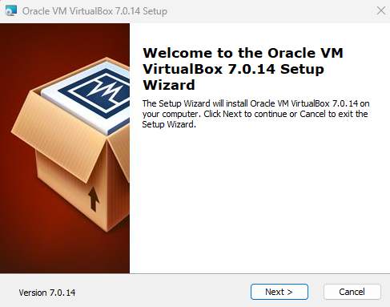
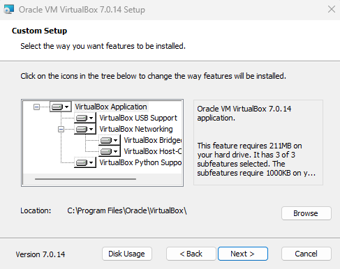
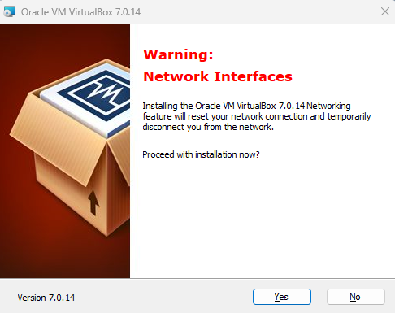

# `01` VirtualBox installation

In this practice you will learn how to create a virtual machine with VirtualBox, and then install an operating system on it. These machines will be your laboratory throughout the course, in them you will be able to explore safely without affecting your machine's own operating system. The worst that can happen is that you will have to install the virtual machine again, but your computer will always be safe.

## Installation on Windows

Visit the official [VirtualBox website](https://www.virtualbox.org/wiki/Downloads) to get the Windows installer. The installation is as simple as any other Windows application. When you run the installer, you will see a wizard that will guide you through the process.

### 1. Run the installer



### 2. Select all the features



### 3. Move on with the buttons "Yes" or "Next" until you finish



## Installation on GNU/Linux

In the case of GNU/Linux systems, we have prepared 2 scripts that will help you with the installation https://www.virtualbox.org/wiki/Linux_Downloads#Debian-basedLinuxdistributions

### Debian-based distributions (deb)

Paste the following code on your terminal:

```bash
wget https://raw.githubusercontent.com/4GeeksAcademy/cybersecurity-scripts/main/installing-virtualbox-linux-debian/install-virtualbox.sh -O - | sudo sh
```

### RedHat based distributions(rpm)

First you need to install the key for rpm by running this command:

```bash
wget -q https://www.virtualbox.org/download/oracle_vbox_2016.asc -O- | rpm --import -
```
Next, you have to install one of these repos according to your distribution.

- Users of Oracle Linux / RHEL can add ​the Oracle Linux [repo file](https://download.virtualbox.org/virtualbox/rpm/el/virtualbox.repo) to /etc/yum.repos.d/.
- Users of Fedora can add ​the Fedora [repo file](https://download.virtualbox.org/virtualbox/rpm/fedora/virtualbox.repo) to /etc/yum.repos.d/.
- Users of openSUSE can add ​the openSUSE [repo file](https://download.virtualbox.org/virtualbox/rpm/opensuse/virtualbox.repo) to /etc/zypp/repos.d/.

## Installing on macOS with Intel CPU

Download the [installer here](https://download.virtualbox.org/virtualbox/7.0.14/VirtualBox-7.0.14-161095-OSX.dmg).

## For any other OS

Visit the downloads section at VirtualBox.org for more options:
https://www.virtualbox.org/wiki/Downloads
