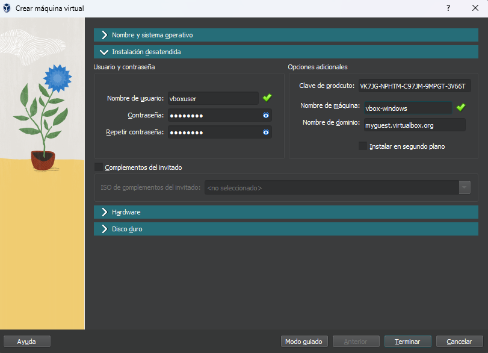

# `03` Installation of virtual machines

In this practice you will learn how to create a virtual machine with VirtualBox, and then install an operating system on it. These machines will be your laboratory throughout the course, in them you will be able to explore safely without affecting your machine's own operating system. The worst that can happen is that you will have to install the virtual machine again, but your computer will be safe.

## 1. Create a new virtual machine

When you open VirtualBox you will see the "New" icon marked with a blue icon.

## 2. Enter a name for your machine and an operating system.

The following is the configuration that the virtual machine must have, the images that are presented are from the `Expert Mode`, verify that you have the mode activated and that the screen that you see are like the images. The same options can be found in `Guided Mode` but with a different presentation.

In the "ISO Image" list you should select the "Other" option and add the file you created in the previous step.

## 3. Unattended installation

In this step you can customize settings of the machine you are creating that will be applied automatically during the installation, so that the installation process will not be interrupted. At the end of the process you will have to choose a couple of privacy options, but the hard work is done.

### Product key

In this case it is important to use a generic product key, this is used to install Windows but not to activate it. Skiping this steps will cause error during instalation

> VK7JG-NPHTM-C97JM-9MPGT-3V66T

## 3. Hardware Configuration

This is where you choose how much memory and processor your machine will have. It is important to allocate what is necessary for optimal operation, without compromising the host machine's own performance.

>You must allocate at least 2 cpus and 2 GB of memory to the machine.

## 3. Storage configuration

In this case, we will use the recommended configuration.

## 6. Finish

When you press the "Finish" button a window will open where you will see your virtual machine. Immediately the installation process begins, and thanks to the unattended installation you will only have to wait until the process is finished and you will have your new virtual machine with Windows 10.
